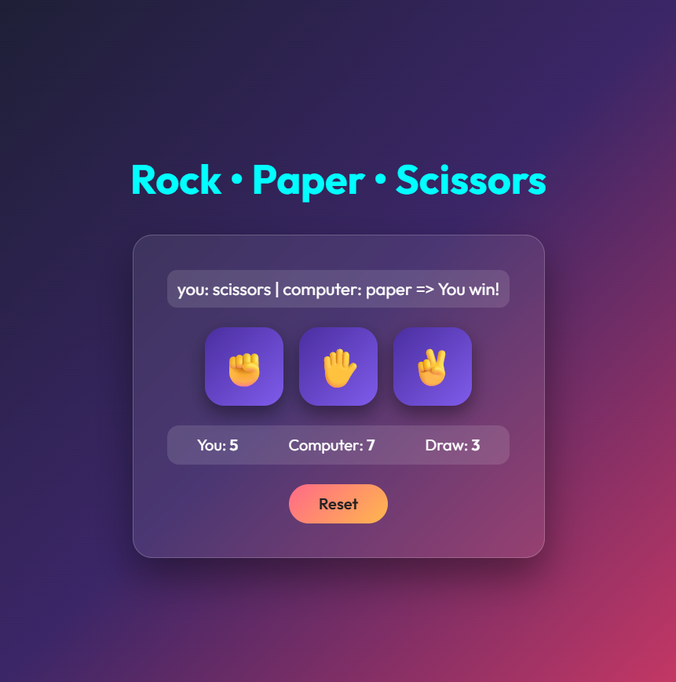

<h1>Rock • Paper • Scissors</h1>

A simple and fun Rock • Paper • Scissors game built using HTML, CSS, and JavaScript.
This project features smooth UI, score tracking, reset option, and instant result display.

<h2>Tech Stack</h2>

    

<h2>Preview</h2>

<h2>Features</h2>

  <li>Clean & Modern UI</li>
    
  <li>Fully Functional Gameplay</li>
    
  <li>Score Tracking</li>
    
  <li>Reset Button</li>
    
  <li>Resets all scores and status display.</li>
    
  <li>Works comfortably on all screen sizes.</li>

 <h2>How the Game Works (Beginner Friendly)</h2>

1.You click one of the options: ✊ Rock, ✋ Paper, ✌️ Scissors

2.The computer randomly selects its move

3.The script compares both moves

4.Result is shown:

5.You win

6.Computer wins

7.Draw

8.Scoreboard updates automatically

9."Reset" button clears all scores

<h2>Future Improvements</h2>

1.Add sound effects

2.Add result animations

3.Add scoreboard persistence using localStorage

4.Add dark/light mode
